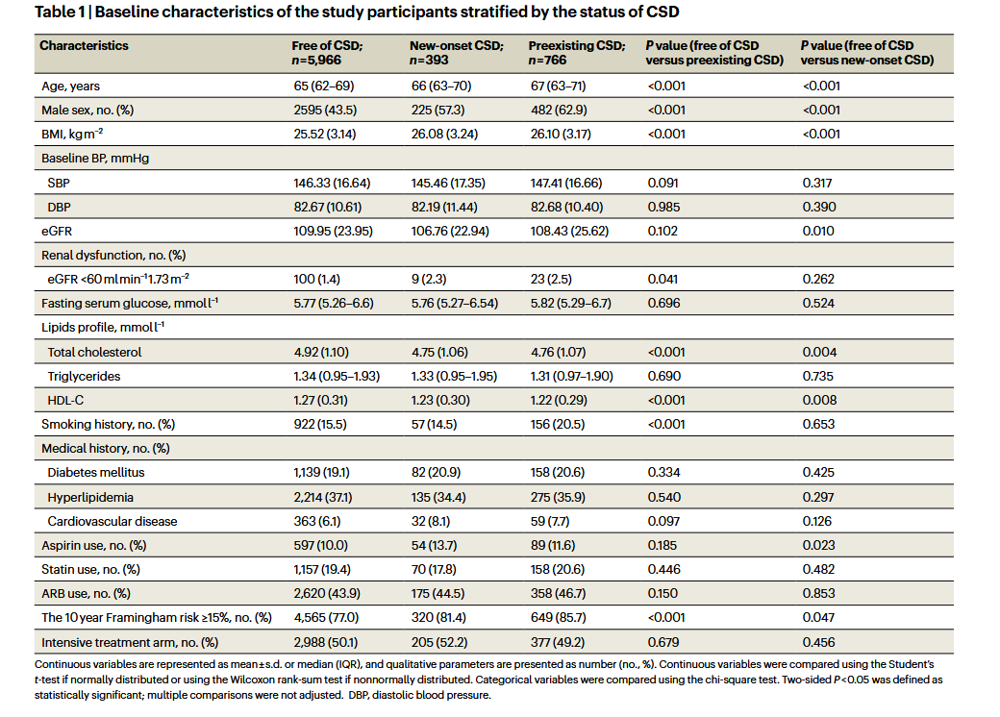
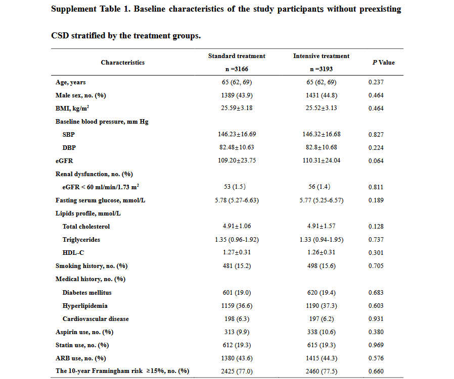
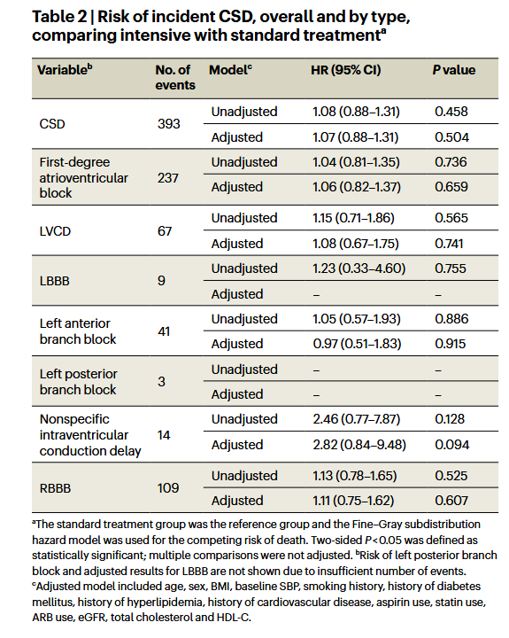
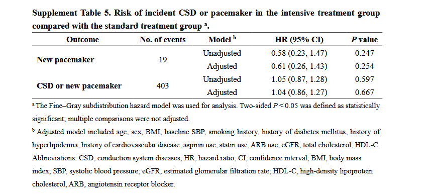
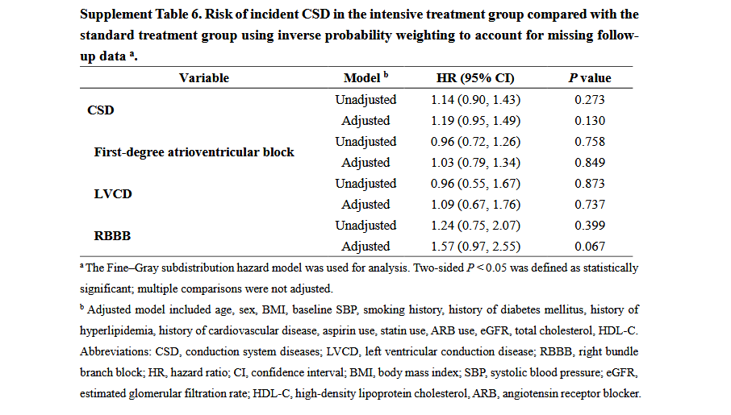
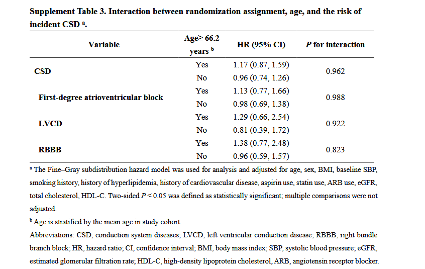
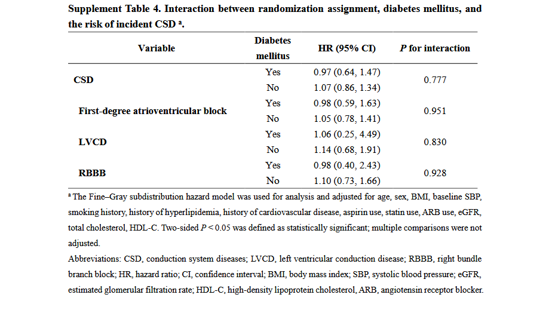
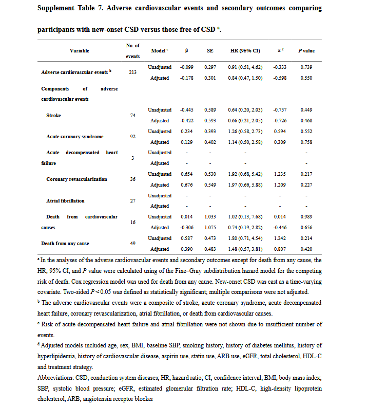

# 研究思路

## 1.基线分析

1、使用描述性统计方法，按是否存在心脏传导系统疾病（CSD）的状态对基线特征进行了比较

在这个基线表中不仅将6,359基线时没有CSD疾病的患者根据结局事件分成了5,966个Free of CSD和393个New-onset CSD，同时还统计了基线就有CSD患者的基线

并同时按照free of CSD versus preexisting CSD和free of CSD versus new-onset CSD进行比对，

如表1 所示，与无 CSD 的患者相比，新发 CSD 患者的年龄更大（中位年龄为 66 岁对 65 岁，P < 0.001），而且更可能是男性（57.3% 对 43.5%，P < 0.001）。新发CSD患者的心血管风险较高（81.4%的患者弗雷明汉风险评分≥15%，而77.0%的患者弗雷明汉风险评分≥15%，P = 0.047）。与新发 CSD 患者相比，无 CSD 的患者总胆固醇（4.92 对 4.75 mmol l-1，P = 0.004）、高密度脂蛋白胆固醇 (HDL-C) （1.27 对 1.23 mmol l-1，P = 0.008）较高，但体重指数 (BMI) （25.52 对 26.08 kg m-2，P = 0.001）较低

2.在没有预先存在CSD的参与者中，按治疗组（强化组vs. 标准组）进行分组和比较，同样使用了描述性统计两组的基线特征是平衡的（补充表 1）

## 2.按临床地点分层的单因素多因素Fine-Gray子分布风险模型评估强化降压和CSD事件之间关联

采用按临床部位分层的单变量和多变量调整Fine-Gray子分布危险模型来考虑死亡的竞争风险，并评估治疗组与CSD事件之间的关联

1. Fine–Gray subdistribution hazard models
   (Fine-Gray子分布风险模型): 这是最关键的术语。它是一种特殊的生存分析模型。
   * 常规生存模型 (如Cox模型) 的问题:
     常规模型只关心“事件A（如新发CSD）是否发生”。但在本研究的老年患者群体中，存在一个问题：一个患者可能还没来得及发生CSD，就因为其他原因（如心梗、癌症）死亡了。
   * 竞争风险 (Competing risk of death): 在这里，“死亡”就是一个竞争风险事件。它的发生，阻止了我们观察到我们真正感兴趣的终点事件（新发CSD）的可能性。如果简单地把死亡的患者当作“删失”（censored，即失访）处理，会高估CSD的发生率，导致结果不准确。
   * Fine-Gray模型的作用:
     这个模型就是专门为了解决竞争风险问题而设计的。它能更准确地估计在存在“死亡”这个竞争事件的情况下，某因素（如强化降压）对于“新发CSD”的真实影响。选择这个模型，是本研究统计方法严谨性的最重要体现之一。
2. Univariable and multivariable-adjusted (单变量和多变量调整):
   * 单变量模型: 分别看每个因素与新发CSD的关系，是初步分析。
   * 多变量模型: 将所有重要因素（治疗组、年龄、性别等）同时放入模型中进行校正。这是为了得到治疗组对新发CSD的独立效应。
3. Stratified by clinical sites (按临床中心分层):
   这是一个处理多中心研究数据的常用高级技巧。由于不同医院（临床中心）的患者基线特征、管理水平可能存在系统性差异，直接把所有数据混在一起分析可能会引入偏倚。通过“分层”，模型允许每个中心的“基础风险水平”不同，但假设治疗的效果（即风险比HR）在所有中心是相同的。这既考虑了中心间的异质性，又整合了所有数据来估计一个统一的治疗效应，比简单地将“中心”作为一个普通协变量放入模型中更为稳健。
4. 多变量模型的校正：多变量模型校正了以下变量：年龄、性别、BMI、基线收缩压、吸烟习惯、是否患有糖尿病、是否患有高脂血症、是否患有心血管疾病、阿司匹林使用、他汀类药物使用、ARB类药物使用、eGFR、总胆固醇、高密度脂蛋白胆固醇以及治疗策略
5. 缺失数据的处理

对于协变量的缺失数据，采用了均值插补的方法

以上的模型不仅是将结局变量用CSD跑一遍，CSD中所有包含的二级结局都跑了一遍，结果如图

1.标准治疗组和强化治疗组新发 CSD 的风险相似（表 2）

2.与标准血压控制组相比，随机分配到强化血压控制组的参与者在多变量调整前后发生一级房室传导阻滞、LVCD 和 RBBB 的风险相似（表 2）

### 敏感性分析

第一项敏感性分析:
植入起搏器的主要原因就是严重的传导系统疾病。因此，把“新发CSD”和“新植入起搏器”合并作为结局事件，是一种更宽泛、可能也更全面的定义。如果在这种定义下，强化降压的保护作用依然存在，就进一步增强了结论的可信度。

第二项敏感性分析: 这是对缺失数据处理的一个重要补充和升级。不是所有患者都按时完成了每一次随访心电图。这种“失访”可能不是随机的（比如，病情更重的患者可能更不愿意来复查）。

* 逆概率加权 (Inverse probability weighting, IPW):
  这是一种更高级的统计方法。它会先建立一个模型来预测哪些人更容易“失访”，然后给那些坚持随访、但特征与“失访者”相似的人更大的权重。通过这种“加权”，使得最终的分析人群在特征上能够更好地代表整个目标人群（包括那些失访的人）。用这种方法来处理结局变量的缺失，比处理协变量缺失的均值插补要复杂和严谨得多，再次体现了研究的高质量。

所有敏感性分析中结果和主分析均保持一致（补充表 5 和 6）

## 3.亚组分析和其他分析

研究对治疗组与CSD的关联进行了亚组分析，分层因素包括年龄（小于平均年龄 vs. 大于等于平均年龄）和是否患有糖尿病（是 vs. 否）。我们还对每一种CSD类别进行了单独分析，包括左心室传导延迟（LVCD）、右束支传导阻滞（RBBB）和一度房室传导阻滞

## 4.CSD对未来心血管事件风险的影响 (预后分析)

1.对于那些已存在或新发生心脏传导系统疾病（CSD）的参与者，研究使用了按临床中心分层的Fine-Gray子分布风险模型来评估他们发生不良心血管事件和次要结局（全因死亡除外）的风险，同时处理了死亡这一竞争风险

* 深度解析:
  * 研究问题: 这里的核心问题是：“如果一个患者有了CSD，他未来发生心梗、卒中或心衰的风险有多高？” 这是一个典型的预后分析。
  * 分析人群: in participants with preexisting or
    new-onset CSD。这里的分析对象是所有被诊断为CSD的患者，不管是在研究开始时就有，还是中途新发生的。
  * 模型选择: 再次使用了先进的 Fine-Gray模型。为什么？因为即使是在这个“CSD患者”队列中，当我们在观察他们是否会发生“心梗”时，“因其他原因死亡”依然是一个竞争风险。一个患者可能还没来得及得心梗就死于癌症了。所以，为了准确评估CSD与心梗等事件的关联，必须使用这个模型。
  * 结局: 模型评估的是adverse cardiovascular events（不良心血管事件）的风险。
  * 重要例外: except for death from any cause（全因死亡除外）。为什么要把“全因死亡”排除在外？因为如果你研究的终点就是“死亡”，那么就不存在任何竞争风险了（人死不能复生，死亡是最终结局）。因此，分析“全因死亡”需要用不同的、更常规的统计模型，这一点在后面的句子中得到了解释。

1.1.新发的CSD被当作一个**时依性协变量（time-varyingcovariate）**来处理

* 深度解析: 这是一个非常高级且严谨的统计处理方法，是高质量生存分析的标志。
  * 什么是时依性协变量？ 一般的协变量（如性别、基线年龄）在整个研究期间是固定不变的。而“时依性协变量”是会随时间变化的。
  * 为什么CSD是时依性的？ 一个患者在研究第一年心电图是正常的，此时他属于“无CSD”状态；在第二年的检查中，他被诊断为“新发CSD”。从那一刻起，他的状态就变成了“有CSD”。
  * 这么做的意义:
    如果不这样处理，简单地把所有“新发CSD”患者都归为“有CSD组”，模型会错误地认为他们从研究第一天开始就一直处于“有CSD”的风险状态下。而通过“时依性”处理，模型可以精确地知道：这个患者在0-2年期间，是作为一个“无CSD”的个体贡献风险时间的；从第2年开始，才作为一个“有CSD”的个体来贡献风险时间。这极大地提高了风险评估的准确性。

2.对于全因死亡的分析，研究采用了按临床中心分层的Cox比例风险回归模型。模型1是未校正的，而模型2则校正了年龄、性别、BMI、基线收缩压、吸烟习惯、……以及治疗策略等一系列变量

* 深度解析:
  * 模型选择: 正如前面预期的，这里换了模型。因为结局是“全因死亡”，没有竞争风险，所以使用最经典的生存分析工具——Cox回归模型就完全足够且恰当。这表明研究者非常清楚不同统计工具的适用边界。
  * 分层分析: 同样采用了按中心分层，以保证多中心数据分析的稳健性。
  * 模型1 vs. 模型2: 这是一种标准的分析策略。
    * 模型1 (未校正): 给出CSD与死亡之间的“粗略”关联。
    * 模型2 (完全校正): 在排除了十几个重要的混杂因素的干扰后，给出CSD与死亡之间的“独立”关联。模型2的结果才是最终的、更有说服力的结论。

