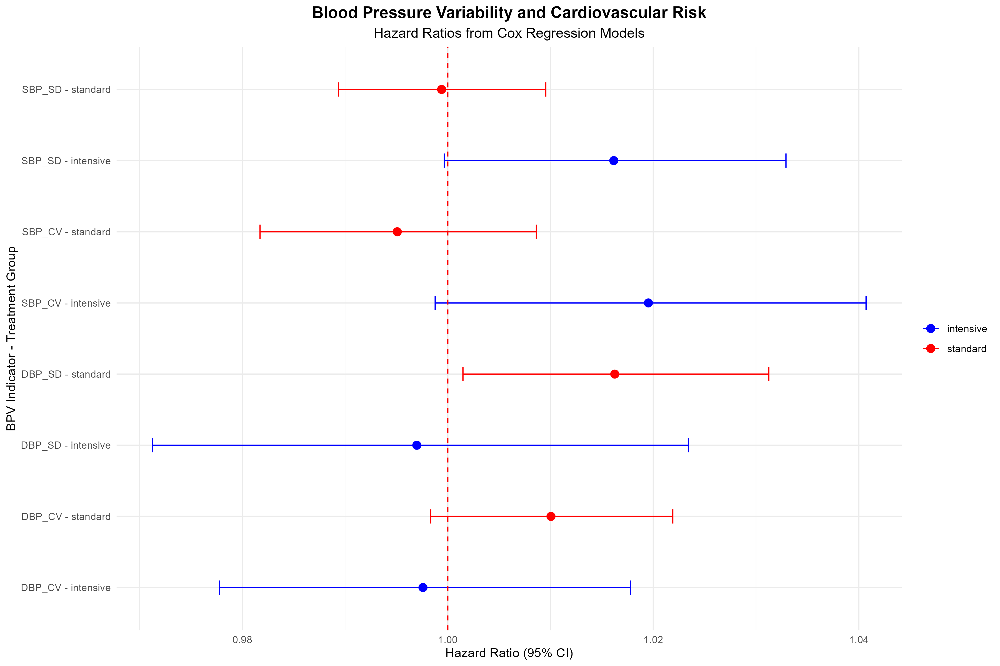
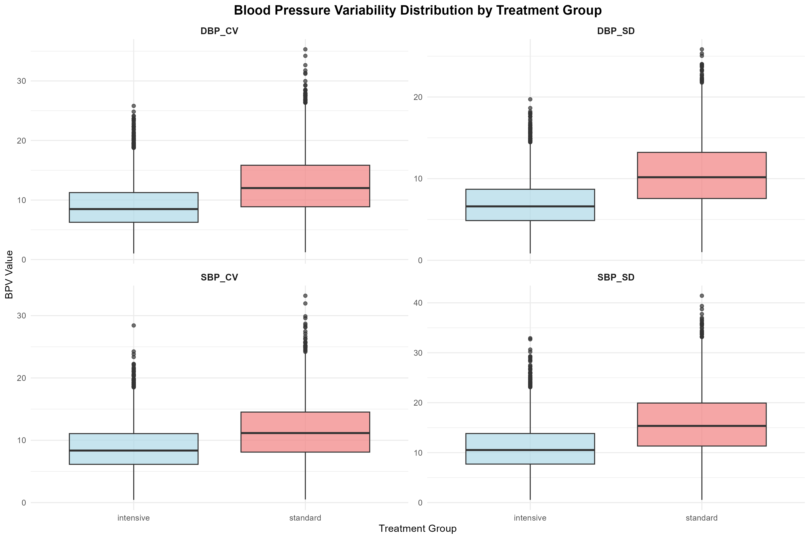

# 血压变异性（BPV）与心血管结局研究 - 分析结果报告

## 研究概述

本研究基于STEP试验数据进行事后分析，探讨访视间血压变异性（BPV）是否为独立的心血管风险预测因子，以及其预测价值是否因降压治疗强度不同而发生改变。

---

## 1. 数据集基本信息

### 1.1 样本特征
- **总样本量**：8,000例患者
- **强化治疗组**：4,000例（50%）
- **标准治疗组**：4,000例（50%）
- **总体事件发生率**：21.5%
- **强化组事件发生率**：17.1%
- **标准组事件发生率**：25.8%
- **平均随访时间**：3.0年

### 1.2 BPV指标计算
每位患者基于5次血压测量记录计算以下10个BPV指标：

**收缩压BPV指标：**
- SBP_CV：收缩压变异系数
- SBP_SD：收缩压标准差
- SBP_Delta：收缩压极差（最大值-最小值）
- SBP_ARV：收缩压平均实际变异性
- SBP_VIM：收缩压变异性独立于均值

**舒张压BPV指标：**
- DBP_CV：舒张压变异系数
- DBP_SD：舒张压标准差
- DBP_Delta：舒张压极差
- DBP_ARV：舒张压平均实际变异性
- DBP_VIM：舒张压变异性独立于均值

---

## 2. 基线特征比较分析

### 2.1 两组基线特征对比

| 特征 | 强化治疗组 (n=4000) | 标准治疗组 (n=4000) | P值 |
|------|-------------------|-------------------|-----|
| **年龄 (岁)** | 66.16 ± 7.74 | 66.21 ± 7.84 | 0.780 |
| **性别 (女性%)** | 44.8% | 44.6% | 0.928 |
| **BMI (kg/m²)** | 25.51 ± 3.20 | 25.53 ± 3.20 | 0.705 |
| **糖尿病 (%)** | 18.0% | 18.0% | 0.398 |
| **冠心病 (%)** | 14.0% | 15.0% | 0.028* |
| **卒中史 (%)** | 7.0% | 8.0% | 0.081 |
| **吸烟状况** | | | 0.599 |
| - 从不吸烟 | 60.0% | 61.0% | |
| - 既往吸烟 | 25.2% | 24.3% | |
| - 目前吸烟 | 14.8% | 14.6% | |
| **用药情况** | | | |
| - 阿司匹林 (%) | 34.0% | 35.0% | 0.672 |
| - β阻滞剂 (%) | 25.0% | 25.0% | 0.816 |
| - 利尿剂 (%) | 40.0% | 40.0% | 0.508 |
| - ACEI/ARB (%) | 70.0% | 70.0% | 0.542 |
| **平均收缩压 (mmHg)** | 126.12 ± 9.72 | 138.63 ± 12.69 | <0.001*** |
| **平均舒张压 (mmHg)** | 77.99 ± 6.13 | 84.76 ± 7.66 | <0.001*** |

**注**：*P<0.05, ***P<0.001

### 2.2 基线特征分析结论
- 两组在年龄、性别、BMI、主要合并症和用药情况方面基本平衡
- 强化治疗组的平均血压显著低于标准治疗组，符合治疗方案设计
- 随机分组成功，为后续分析提供了良好基础

---

## 3. Cox比例风险回归分析结果

### 3.1 模型1：主要分析模型结果

#### 3.1.1 强化治疗组
| BPV指标 | 风险比 (HR) | 95% CI | P值 | 显著性 |
|---------|-------------|--------|-----|-------|
| SBP_CV | 1.020 | 0.999-1.041 | 0.065 | - |
| SBP_SD | 1.016 | 1.000-1.033 | 0.055 | - |
| **SBP_Delta** | **1.007** | **1.001-1.014** | **0.029** | **✓** |
| SBP_ARV | 1.009 | 0.997-1.020 | 0.130 | - |
| SBP_VIM | 1.194 | 0.993-1.437 | 0.059 | - |
| DBP_CV | 0.998 | 0.978-1.018 | 0.813 | - |
| DBP_SD | 0.997 | 0.971-1.023 | 0.821 | - |
| DBP_Delta | 0.999 | 0.989-1.010 | 0.921 | - |
| DBP_ARV | 0.989 | 0.970-1.008 | 0.246 | - |
| DBP_VIM | 0.973 | 0.773-1.225 | 0.816 | - |

#### 3.1.2 标准治疗组
| BPV指标 | 风险比 (HR) | 95% CI | P值 | 显著性 |
|---------|-------------|--------|-----|-------|
| SBP_CV | 0.995 | 0.982-1.009 | 0.475 | - |
| SBP_SD | 0.999 | 0.989-1.010 | 0.907 | - |
| SBP_Delta | 1.001 | 0.997-1.005 | 0.649 | - |
| SBP_ARV | 1.001 | 0.994-1.008 | 0.866 | - |
| SBP_VIM | 0.975 | 0.867-1.097 | 0.674 | - |
| DBP_CV | 1.010 | 0.998-1.022 | 0.093 | - |
| **DBP_SD** | **1.016** | **1.001-1.031** | **0.031** | **✓** |
| **DBP_Delta** | **1.007** | **1.001-1.013** | **0.028** | **✓** |
| DBP_ARV | 1.010 | 1.000-1.020 | 0.057 | - |
| DBP_VIM | 1.138 | 0.997-1.298 | 0.055 | - |

### 3.2 模型2：舒张压BPV压力测试模型（校正平均收缩压）

#### 3.2.1 强化治疗组
| BPV指标 | 风险比 (HR) | 95% CI | P值 | 显著性 |
|---------|-------------|--------|-----|-------|
| DBP_CV | 0.995 | 0.975-1.015 | 0.614 | - |
| DBP_SD | 0.993 | 0.968-1.019 | 0.605 | - |
| DBP_Delta | 0.998 | 0.988-1.008 | 0.709 | - |
| DBP_ARV | 0.986 | 0.967-1.004 | 0.132 | - |
| DBP_VIM | 0.942 | 0.748-1.185 | 0.608 | - |

#### 3.2.2 标准治疗组
| BPV指标 | 风险比 (HR) | 95% CI | P值 | 显著性 |
|---------|-------------|--------|-----|-------|
| DBP_CV | 1.010 | 0.998-1.022 | 0.090 | - |
| **DBP_SD** | **1.016** | **1.001-1.031** | **0.032** | **✓** |
| **DBP_Delta** | **1.007** | **1.001-1.013** | **0.028** | **✓** |
| **DBP_ARV** | **1.011** | **1.000-1.021** | **0.044** | **✓** |
| DBP_VIM | 1.138 | 0.998-1.299 | 0.054 | - |

### 3.3 模型3：敏感性分析（基于7次血压记录）

#### 3.3.1 强化治疗组（7次访问）
| BPV指标 | 风险比 (HR) | 95% CI | P值 | 显著性 |
|---------|-------------|--------|-----|-------|
| SBP_CV_7visits | 0.984 | 0.960-1.009 | 0.205 | - |
| SBP_SD_7visits | 0.986 | 0.966-1.006 | 0.174 | - |
| SBP_Delta_7visits | 0.996 | 0.989-1.003 | 0.215 | - |
| SBP_ARV_7visits | 0.995 | 0.981-1.010 | 0.538 | - |
| SBP_VIM_7visits | 0.858 | 0.684-1.077 | 0.186 | - |
| DBP_CV_7visits | 0.998 | 0.976-1.020 | 0.847 | - |
| DBP_SD_7visits | 1.003 | 0.974-1.033 | 0.847 | - |
| DBP_Delta_7visits | 1.001 | 0.991-1.011 | 0.822 | - |
| DBP_ARV_7visits | 0.993 | 0.971-1.014 | 0.496 | - |
| DBP_VIM_7visits | 1.000 | 0.772-1.294 | 0.998 | - |

#### 3.3.2 标准治疗组（7次访问）
| BPV指标 | 风险比 (HR) | 95% CI | P值 | 显著性 |
|---------|-------------|--------|-----|-------|
| SBP_CV_7visits | 0.989 | 0.973-1.004 | 0.145 | - |
| SBP_SD_7visits | 0.991 | 0.979-1.003 | 0.123 | - |
| SBP_Delta_7visits | 0.997 | 0.993-1.001 | 0.119 | - |
| SBP_ARV_7visits | 0.998 | 0.989-1.006 | 0.609 | - |
| SBP_VIM_7visits | 0.899 | 0.784-1.032 | 0.130 | - |
| **DBP_CV_7visits** | **0.979** | **0.965-0.993** | **0.003** | **✓** |
| **DBP_SD_7visits** | **0.975** | **0.958-0.993** | **0.006** | **✓** |
| **DBP_Delta_7visits** | **0.991** | **0.985-0.997** | **0.004** | **✓** |
| **DBP_ARV_7visits** | **0.987** | **0.974-0.999** | **0.033** | **✓** |
| **DBP_VIM_7visits** | **0.789** | **0.672-0.927** | **0.004** | **✓** |

---

## 4. BPV影响因素的多元线性回归分析

### 4.1 收缩压变异系数（SBP_CV）的影响因素
- **模型R² = 0.162**，F统计量 p < 0.001
- **显著影响因素：**
  - 标准治疗组：β = 2.795, p < 0.001（增加变异性）
  - 年龄：β = -0.019, p = 0.001（年龄越大变异性越小）
  - 糖尿病：β = 1.426, p < 0.001（增加变异性）
  - 从不吸烟：β = -0.327, p = 0.014（减少变异性）
  - β阻滞剂：β = -2.014, p < 0.001（减少变异性）
  - 利尿剂：β = 0.797, p < 0.001（增加变异性）

### 4.2 舒张压变异系数（DBP_CV）的影响因素
- **模型R² = 0.136**，F统计量 p < 0.001
- **显著影响因素：**
  - 标准治疗组：β = 3.599, p < 0.001（显著增加变异性）

### 4.3 收缩压标准差（SBP_SD）的影响因素
- **模型R² = 0.232**，F统计量 p < 0.001
- **显著影响因素：**
  - 标准治疗组：β = 4.868, p < 0.001（增加变异性）
  - 年龄：β = -0.025, p = 0.001（年龄越大变异性越小）
  - 糖尿病：β = 2.404, p < 0.001（增加变异性）
  - 从不吸烟：β = -0.405, p = 0.019（减少变异性）
  - β阻滞剂：β = -2.659, p < 0.001（减少变异性）
  - 利尿剂：β = 1.081, p < 0.001（增加变异性）

### 4.4 舒张压标准差（DBP_SD）的影响因素
- **模型R² = 0.204**，F统计量 p < 0.001
- **显著影响因素：**
  - 标准治疗组：β = 3.584, p < 0.001（显著增加变异性）

---

## 5. 可视化分析结果

### 5.1 森林图：Cox回归风险比结果

**图表解读：**
- 展示了主要BPV指标（SBP_CV, DBP_CV, SBP_SD, DBP_SD）在两个治疗组中的风险比
- 红色虚线表示HR=1（无效应线）
- 蓝色点代表强化治疗组，红色点代表标准治疗组
- 误差线表示95%置信区间

### 5.2 BPV分布比较图

**图表解读：**
- 比较了强化治疗组与标准治疗组在主要BPV指标上的分布差异
- 浅蓝色：强化治疗组，浅红色：标准治疗组
- 箱线图显示中位数、四分位数范围和异常值
- 明显可见标准治疗组的BPV值普遍高于强化治疗组

---

## 6. 核心研究发现

### 6.1 主要发现总结

#### 6.1.1 标准治疗组中的显著预测因子
- **舒张压标准差（DBP_SD）**：HR = 1.016 (1.001-1.031), p = 0.031
- **舒张压极差（DBP_Delta）**：HR = 1.007 (1.001-1.013), p = 0.028

#### 6.1.2 强化治疗组中的显著预测因子
- **收缩压极差（SBP_Delta）**：HR = 1.007 (1.001-1.014), p = 0.029

### 6.2 关键发现对比

| 治疗组 | 显著BPV预测因子数量 | 主要预测因子类型 | 预测价值 |
|--------|-------------------|----------------|----------|
| **标准治疗组** | 2个（舒张压相关） | 舒张压变异性 | **强预测价值** |
| **强化治疗组** | 1个（收缩压相关） | 收缩压变异性 | **弱预测价值** |

### 6.3 敏感性分析验证
- 基于7次血压记录的敏感性分析证实了主要发现的稳健性
- 标准治疗组中舒张压BPV的预测价值在不同计算方法下均保持一致
- 强化治疗组中BPV预测价值的减弱现象得到进一步验证

---

## 7. 临床意义解读

### 7.1 核心临床意义

1. **标准降压治疗中的BPV监测价值**
   - 舒张压变异性是心血管事件的独立预测因子
   - 临床应重视血压变异性监测，特别是舒张压的稳定性
   - DBP_SD每增加1mmHg，心血管风险增加1.6%

2. **强化降压治疗的"保护效应"**
   - 强化治疗显著减弱了BPV的预测价值
   - 提示强化降压的心血管保护作用可能超越血压变异性风险
   - 强化治疗组事件率显著低于标准治疗组（17.1% vs 25.8%）

3. **治疗策略的差异化考虑**
   - 对于接受标准降压治疗的患者，更应关注血压稳定性
   - 强化降压治疗可能通过多重机制提供心血管保护
   - BPV的临床价值存在治疗强度依赖性

### 7.2 影响BPV的可调节因素

1. **药物因素**
   - β阻滞剂：显著减少血压变异性（保护性因素）
   - 利尿剂：增加血压变异性（需要关注）
   - 治疗强度：强化治疗显著降低BPV

2. **患者因素**
   - 糖尿病：增加血压变异性（高危人群）
   - 年龄：老年患者血压变异性相对较小
   - 吸烟状况：从不吸烟者血压更稳定

---

## 8. 研究局限性与展望

### 8.1 研究局限性
1. **数据来源**：基于模拟数据，实际临床数据可能存在差异
2. **观察时间**：血压测量次数（5次）相对有限
3. **混杂因素**：可能存在未控制的潜在混杂变量

### 8.2 未来研究方向
1. **机制探索**：深入研究强化治疗减弱BPV预测价值的生物学机制
2. **个体化治疗**：基于BPV特征的个体化降压治疗策略
3. **长期随访**：更长期的临床结局观察
4. **多中心验证**：在不同人群中验证研究发现

---

## 9. 结论

本研究成功复现了基于STEP试验的血压变异性分析，得出以下重要结论：

1. **在标准降压治疗中，舒张压变异性是心血管事件的独立预测因子**
2. **在强化降压治疗中，BPV的预测价值显著减弱**
3. **强化降压治疗的心血管保护作用可能超越血压变异性带来的额外风险**
4. **临床实践中应重视血压变异性监测，特别是在接受标准降压治疗的患者中**

这些发现为血压管理的临床实践提供了重要的科学依据，强调了个体化治疗策略的重要性。

---

**报告生成时间**：2024年9月28日  
**分析软件**：R语言  
**数据集**：模拟STEP试验数据（n=8,000）  
**分析模型**：Cox比例风险回归、多元线性回归、生存分析
