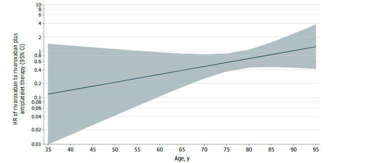
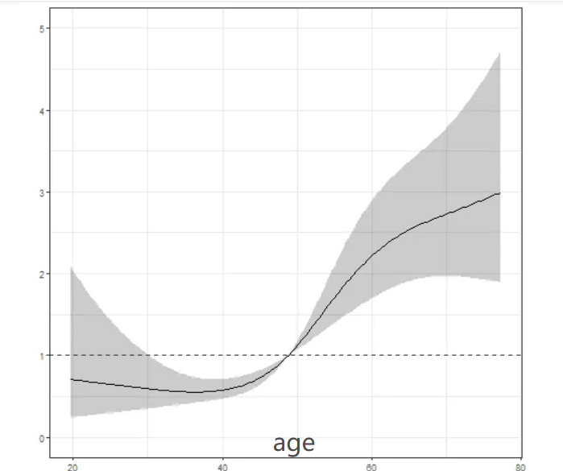

# 分箱式亚组分析+连续性交互作用曲线+不调整协变量满足真实世界

## 文章追求一种真实世界中的单药是否可以应用的目的

一、 现有研究现状 (State of Current Research)

通过引言部分，作者为我们梳理了关于心房颤动（AF）和冠心病（CAD）患者抗血栓治疗的现有知识、关键发现和尚未解决的问题。可以总结为以下几点：

1. 宏观背景：问题普遍且严重
   * 随着社会老龄化，房颤（AF）的发病率越来越高。
   * 直接口服抗凝药（DOACs）已成为治疗房颤的一线药物。
   * 老年房颤患者面临一个核心矛盾：他们既有很高的血栓风险（如中风），也有很高的出血风险，治疗非常棘手。
2. 针对高龄患者的探索已有进展
   * ELDERCARE-AF 试验发现，对于不适合标准剂量抗凝药的 ≥80
     岁高龄患者，使用低剂量依度沙班（edoxaban）比安慰剂能更有效地预防中风，且不会显著增加大出血风险。这证明了为老年人“量身定制”低强度抗凝方案是可行的。
   * 一项中国老年房颤患者注册研究指出，如果老年患者同时患有房颤（AF）和冠心病（CAD），他们的血栓和出血风险会比单纯只有房颤的患者更高。这进一步指出了“AF+CAD”这个患者群体的特殊性和高危性。
3. 奠基性的 AFIRE 试验
   * 在同时患有房颤和稳定性冠心病的患者中，AFIRE 试验是一个里程碑式的研究。
   * 它是第一个证明了利伐沙班单药治疗（Rivaroxaban
     Monotherapy）与利伐沙班+抗血小板的联合治疗相比，在预防心血管事件方面效果同样出色，并且能显著降低出血风险。
   * 这个试验的结论是革命性的，因为它提示对于这类病情稳定的患者，使用一种药物（单药）可能比使用两种药物（联合）更好，实现了“疗效不减，安全更优”。
4. 当前研究中存在的明确空白 (The Gap)
   * 尽管 AFIRE
     试验得出了“单药治疗更优”的总体结论，但它并没有详细分析这个结论是否适用于所有年龄段的患者。
   * 作者特别强调，对于老年患者（尤其是做过心脏支架/PCI的），年龄因素至关重要，因为他们常伴有多种用药（polypharmacy）、药物耐受性差、依从性不高等问题。
   * 最关键的一句话是：“然而，至今尚无针对这些特定患者的年龄分层研究 (no age-specific studies have examined
     these specific patients to date)。” 这句话直接点明了现有研究的空白。

二、 作者撰写这篇文章的意义 (Significance of This
Study)

基于上述研究现状和空白，作者撰写这篇文章的意义就非常明确和重要了：

1. 填补研究空白
   * 本文的核心目的，就是去回答那个悬而未决的问题：**AFIRE 试验发现的“利伐沙班单药治疗的优势”，在不同年龄组（尤其是高龄组）中是否同样存在？**
   * 他们希望通过对 AFIRE
     试验的数据进行事后分析 (post hoc analysis)，来专门考察年龄对两种治疗方案疗效和安全性的影响。
2. 为临床实践提供更精细化的指导
   * 如果研究发现，利伐沙班单药治疗的优势在
     80
     岁以上的老年人中同样显著，甚至更优，那么这将为医生在治疗这类高危、脆弱的患者时提供强有力的证据，可以更放心地简化治疗方案，从而大幅降低其出血风险。
   * 反之，如果发现在某个年龄段，单药治疗效果不佳或优势不明显，也同样是重要的信息，可以提醒医生需要采取更谨慎的个体化策略。
3. 推动个体化精准医疗
   * 这项研究的本质是从“一体适用”的结论（单药优于联合治疗）向“因人而异”的个体化治疗迈进。通过“年龄分层”这个维度，研究试图为不同年龄的患者群体找到最佳的治疗策略，这完全符合现代精准医疗的理念。

## 最小化随机化

1. 为什么要用最小化随机化？（它解决了什么问题）

在临床试验中，我们最希望的就是治疗组和对照组在入组时，所有特征都一模一样，唯一的区别就是接受的干预不同。这样，试验结束时出现的任何差异，我们都可以归因于干预措施。

* 简单随机化（如抛硬币）的问题： 在样本量很大时（如几千人），抛硬幣最终能让两组的特征（如男女比例、年龄分布）大致趋于平衡。但在样本量不大时，很容易出现“运气不好”的情况，比如A组碰巧分到了更多病情严重的老年男性，B组则分到了更多病情较轻的年轻女性，导致两组不具有可比性。
* 分层随机化（Stratified
  Randomization）的局限： 为了解决上述问题，人们发明了分层随机化。比如，我们可以先把患者按“性别”（男/女）和“年龄”（</>60岁）分成4个层，然后在每个层内部进行简单的随机化。这样能保证在每个层里，两组人数都是平衡的。但如果我们要平衡的因素很多（比如年龄、性别、病史、分期、吸烟史等），那分层的数量就会呈指数级暴增（2x2x2x2x2...），导致每个“层”里几乎没有病人，分层就失去了意义。

最小化随机化法正是为了解决“想平衡多个关键因素，但分层法又行不通”这个难题而诞生的。

2. 最小化随机化是如何工作的？（核心原理）

它的核心思想是**“边际平衡
(Marginal Balance)”。它不追求在所有因素组合的“层”里都平衡，而是追求在每一个单一因素的各个水平上**都达到平衡。

下面我们通过一个简化的例子来理解它的工作流程：

场景设定：

* 我们有一个试验，分为 A组 和 B组。
* 我们希望平衡 3个关键因素：
  1. 性别: 男 / 女
  2. 年龄: < 60岁 / ≥ 60岁
  3. 吸烟史: 是 / 否

工作流程：

1. 第一位患者入组： 对于第一位入组的患者，系统会进行一次纯粹的简单随机化（比如50/50概率）将其分到 A组 或 B组。因为此时没有任何不平衡可言。
2. 下一位（第 n+1 位）患者入组： 这是最关键的一步。假设现在来了一位新的患者，他的特征是【男性，≥ 60岁，吸烟】。系统会做如下的“思想实验”：

   * 步骤 A：计算当前各组的“不平衡总分”
     * 系统会先看一下目前 A组
       和 B组 中，符合这位新患者特征的人数。
     * 假设当前各组人数如下：

       | 特征 | A组已有 | B组已有 |

       | :--- | :--- | :--- |

       | 男性 | 10人 | 12人 |

       | ≥ 60岁 | 8人 | 7人 |

       | 吸烟 | 5人 | 6人 |
   * 步骤 B：进行“虚拟分配”并计算分配后的不平衡分数
     * 假设 1：如果把这位新患者分到 A组
       * 那么A组将有11个男性，9个≥60岁，6个吸烟者。
       * 我们计算一个**“不平衡分数”**：把他所有特征在A组的人数加起来。分数
         = 11 + 9 + 6 = 26。
     * 假设 2：如果把这位新患者分到 B组
       * 那么B组将有13个男性，8个≥60岁，7个吸烟者。
       * B组的**“不平衡分数”**
         = 13 + 8 + 7 = 28。
   * 步骤 C：做出分配决定
     * 比较两个假设的分数：A组（26分）<
       B组（28分）。
     * 这意味着，如果把他分到A组，整个研究在“性别”、“年龄”和“吸烟史”这三个维度上的总体不平衡程度会更小。
     * 因此，系统会把他分配到 A组。
3. 引入随机成分（重要！）： 如果完全按照上面的规则，那这个过程就是确定的，研究者可能会预测出下一个患者的分组，从而产生偏倚。为了避免这一点，实际操作中会加入一个随机元素。最常见的方法是使用**“有偏倚的硬币 (Biased Coin)”**：

   * 系统仍然会把他分配到分数更低的A组，但不是100%的概率，而是比如**80%**的概率。
   * 同时，给予他**20%**的概率被分配到分数更高的B组。
   * 这样既保证了总体的平衡趋势，又保留了随机化的不可预测性。
4. 重复此过程： 每一位新患者入组时，系统都会重复上述的计算和分配过程，动态地维持着整个队列的平衡。
5. 优点和缺点

优点：

* 平衡性极佳： 特别是在中小型临床试验中，它在平衡多个关键预后因素方面的效果远超简单随机化和分层随机化。
* 灵活性高： 可以轻松处理多个（例如5-10个）需要平衡的协变量。
* 概念直观： “哪里不平补哪里”的思想很容易理解。

缺点：

* 实施复杂： 无法通过简单的信封法等手动完成，必须依赖中央计算机系统来实时计算和分配。
* 可能存在可预测性： 如果不加入随机成分（有偏倚的硬币），分配过程是确定的，有引入选择偏倚的风险。
* 统计分析的考量： 一些统计学家认为，因为随机化过程本身依赖于这些协变量，所以在最终的统计分析模型中，也应该将这些变量作为协变量进行调整，以获得最准确的结果。

## 本文两种核心模型

### 1.事件风险 ~ 治疗方案 + 分层年龄 + (治疗方案 × 年龄)——这其实是亚组分析

### 2.事件风险 ~ 治疗方案 + 连续年龄 + (治疗方案 × 年龄)——这用来看单药VS多药HR随年龄变化趋势

#### 这两种模型我们应该怎么理解

一个比喻：比较两种篮球训练方法

假设我们要比较 A训练法 和 B训练法 哪个更能让人长高。我们招募了100个孩子，随机分成两组，进行训练。

一年后，我们发现A组平均身高165cm，B组平均身高160cm。但是，我们回头一看，因为随机分配时的“坏运气”，A组孩子的平均年龄是15岁，而B组平均年龄只有13岁。

现在我们面临一个巨大的问题：A组长得更高，是因为训练法A真的更好，还是仅仅因为他们本来就年龄更大、处于生长发育的猛涨期？

这时，我们有两种分析思路：

思路一：亚组分析（等同于您的“分段分析”）

我们把孩子按年龄分成几个组：“12-13岁组”和“14-15岁组”。

* 在“12-13岁组”内部，我们比较 A训练法 vs B训练法
  的身高差异。
* 在“14-15岁组”内部，我们再比较 A训练法 vs B训练法
  的身高差异。

这个方法非常直观，就等同于您理解的：

在每个年龄亚组里进行 事件风险 ~ 治疗方案 + 分层年龄 + (治疗方案 × 年龄)的模型。

它回答的问题是：“对于12-13岁的孩子，A法比B法好多少？”以及“对于14-15岁的孩子，A法比B法又好多少？”

思路二：多变量回归模型（等同于您困惑的模型）

我们建立一个模型：身高 ~ 训练方法 + 年龄+ (治疗方案 × 年龄)。

这个模型在做什么？它在用统计学的方法，“剥离”掉年龄的天然影响，来看训练方法“纯粹”的效果。

这个模型会输出两个结果：

1. 训练方法的效果：这个结果的含义是：“在年龄完全相同的情况下，接受A训练法的孩子，预计比接受B训练法的孩子高多少厘米？”
   它通过数学方法，把所有孩子都拉到了一个“虚拟的同一起跑线”上（即年龄相同），然后再进行比较。
2. 年龄的效果：这个结果的含义是：“在接受相同训练方法的情况下，年龄每增加1岁，身高预计会增加多少厘米？”

剖析 事件风险 ~ 治疗方案 + 连续年龄 + (治疗方案 × 年龄) 这个模型

您完全说对了，这个模型输出的HR，其含义与亚组分析的HR是完全不一样的。它们回答的是两个不同的问题。

1. 这个模型输出的HR是什么意思？

这个模型会给你两个主要的HR：

* HR for 治疗方案 (单药 vs 联合):
  * 它的含义是：“在年龄完全相同（或说，在统计上校正了年龄差异后），接受单药治疗的患者，其事件风险是接受联合治疗患者的多少倍？”
  * 这是一个**“年龄调整后
    (Age-Adjusted)”的HR。它提供了一个总体的、平均的**治疗效果评估，这个评估已经排除了“因为一组患者比另一组老，所以风险天然就高”这种混杂因素的干扰。
* HR for 年龄 (作为连续变量):
  * 它的含义是：“在接受相同治疗方案的情况下，年龄每增加1岁，患者的事件风险会变成原来的多少倍？”
  * 例如，如果年龄的HR是1.05，就意味着在用药方案相同的前提下，一个71岁的患者的事件风险，比一个70岁的患者高出5%。
  * 这个HR量化了年龄本身作为一个独立风险因素的强度。

#### 本文两种核心模型为什么要有交互项呢，不可以直接用事件风险 ~ 治疗方案 + 年龄呢

这是一个含金量极高的问题，它直接触及了**“调整”和“交互”**这两个统计学概念的根本区别。

您说得完全没错，如果使用 事件风险 ~ 治疗方案 +
年龄 这个没有交互项的模型，我的代码同样可以跑得动，也会生成一张图。

但关键在于，它生成的将是一张完全不同的、表达着完全不同含义的、并且无法回答我们核心问题的图。

1. 如果我们用 ~
   治疗方案 + 年龄 (没有交互项)

* 模型假设： 利伐沙班单药相对于联合治疗的优势（即HR值）在所有年龄段都是一个固定的常数。它假设HR在35岁时是0.7，在95岁时也必须是0.7。
* 它会画出什么图？
  * 它会画出一条完美的水平线！因为模型本身就禁止HR随年龄变化。
  * 这张图的意义是：“在统计学校正了年龄的混杂效应后，我们计算出单药治疗的平均HR是0.7。” 这张图无法回答我们“HR是否随年龄变化”的问题，因为它从一开始就假设了它不变。

2. 为什么我们必须用 ~
   治疗方案 * 年龄 (有交互项)

* 模型允许： 利伐沙班单药相对于联合治疗的优势（HR值）可以随着年龄的增长而改变。HR在35岁时可以是一个值，在95岁时可以是另一个值。
* 它会画出什么图？
  * 它会画出一条倾斜的线（或者曲线），精确地展示了HR值是如何从一个年龄点的估计值，平滑地过渡到另一个年龄点的估计值。
  * 这正是AFIRE文章中那张图要表达的核心思想！那张图的全部意义，就在于展示HR不是一条水平线。

## 本文不去再次调整基线差异也不去再次将一些基线变量纳入模型的重要原因

### 1、AFIRE 试验采用 minimization method (最小化随机化法)，在分组时就已经平衡了关键基线变量（年龄、性别、PCI史、心衰、高血压、糖尿病、卒中史等），所以我们的研究中不再次对基线的变量进行调整

随机化的力量与局限性

* 力量： AFIRE试验使用的最小化随机化法 (Minimization) 是一种非常强大的动态随机化方法。与简单的抛硬币不同，它在分配每一个新入组的患者时，都会计算如果把他分到A组或B组，哪种分配更能让两组间的关键协变量（年龄、性别、病史等）保持平衡。因此，它能确保在整个研究人群中，两组的基线特征高度可比。
* 局限性（您问题的核心）： 随机化的平衡保证是针对整个队列的。当你事后（post hoc）根据某个变量（比如年龄）把这个队列切分成几个小份（亚组）时，就不能保证在每一个小份内部，治疗组和对照组的其他协变量依然是完美平衡的。
  * 举个例子： 假设整个研究中，单药组和联合组的糖尿病患者比例都是30%，完美平衡。但当你只看“<70岁”这个亚组时，可能因为偶然性，单药组的糖尿病比例是25%，而联合组是35%。这种情况是完全可能发生的。

2. 为什么在这种情况下，作者依然选择“不调整”？

这主要基于以下几个更深层次的理由：

理由一：研究的核心目的在于“交互作用检验”，而非“亚组内的精确估计”

* 这篇文章的首要科学问题不是“在72岁的人群中，单药治疗的风险比（HR）究竟是0.65还是0.68？”。
* 它的首要科学问题是：“单药治疗的效果（HR），是否会随着年龄的增长而发生有统计学意义的改变？”
* 回答这个问题，靠的是交互作用检验 (Test for Interaction)。这个检验看的是一个整体趋势。它考察的是“治疗效果”和“年龄”这两个因素之间是否存在关联。
* 在这种检验的框架下，只要最初的随机化保证了整体的平衡，那么交互作用检验的结果就是相对稳健的。大家默认随机化带来的平衡性会“大致”延续到各个亚组中，微小的不平衡会被视为随机噪音。

理由二：亚组分析的统计学效能（Power）有限，过度调整有风险

* 亚组样本量小： 当你把2215个患者分成4个年龄组，每个组里的人数就少了很多。再把每个年龄组分成两个治疗组，每个格子里的样本量就更小了。
* 过度拟合
  (Overfitting) 的风险： 在一个样本量不大的数据集上，如果你试图用一个复杂的统计模型（比如包含6-7个调整变量的Cox模型）去进行分析，模型很可能会“过度拟合”。这意味着模型会去拟合数据中的随机噪音，而不是真实的规律，导致结果非常不稳定、不可靠，置信区间也会变得非常宽。
* 保守与稳健的选择： 因此，在统计学效能已经因分组而降低的情况下，采用一个更简洁的非调整模型 (Unadjusted Model)，反而是一种更稳健、更保守的做法。它依赖于最初随机化的“底子”，来得出一个虽然粗略但不容易出错的结论。

理由三：对随机对照试验（RCT）基本原则的信任

* RCT的基石在于**“随机化”。理论上，只要随机化做得好，它不仅能平衡我们已知的协变量（年龄、性别等），还能平衡所有我们未知**的混杂因素。
* 因此，在分析RCT数据时，有一个主流观点是：分析应该遵循随机化的设计本身。既然设计是通过随机化来控制混杂的，那么分析时就应该信任随机化的结果，直接比较两组即可（即非调整分析）。只有当随机化不幸失败，导致了严重的基线不平衡时，才需要进行强制性的协变量调整。

总结：一个权衡利弊的决定

所以，作者“不再调整协变量”的决定，是一个深思熟虑后的权衡：

| 考虑因素 | 选择“不调整”的理由                                         | 选择“调整”的理由（但作者未采纳）                 |
| -------- | ------------------------------------------------------------ | -------------------------------------------------- |
| 研究目的 | 核心是检验交互作用的整体趋势，而非追求各亚组内HR的绝对精确。 | 如果想得到每个亚组最精确的点估计值，应该调整。     |
| 统计效能 | 亚组样本量小，不调整可以避免过度拟合，结果更稳健。           | 调整后理论上更精确，但可能因样本小导致结果不稳定。 |
| 设计原则 | 尊重并信任原始RCT的随机化设计，这是控制混杂的根本。          | 承认亚组内可能存在随机不平衡，通过调整来纠正。     |

结论就是：作者认为，强大的最小化随机化方法已经为研究打下了坚实的基础。对于这次探索性的亚组分析，其主要目的是看一个大的趋势（交互作用），采用简洁的非调整模型是更可靠、更不容易被噪音干扰的方法。如果交互作用检验真的发现了显著差异，那么下一步才可能需要进行更复杂的、经过调整的亚组分析来进一步探究。

AFIRE
的 Cox 主分析没有调整协变量，是因为 minimization
随机化在总体层面已保证组间平衡。但进入亚组后，随机化的平衡性可能被打破，如果严格的话可以再做协变量调整。文中选择“不调整”是为了保持与主试验分析框架一致，并避免小样本亚组过拟合，但这意味着亚组结论更偏向“探索性”而非定论

### 2、不纳入协变量可以更好的贴合文章的研究目的——AFIRE 试验发现的“利伐沙班单药治疗的优势”，在不同年龄组（尤其是高龄组）中是否同样存在？，文章更想探究真实世界利伐沙班单药治疗是否可以直接应用于高龄组，所以不纳入协变量可以更好的贴合满足真实世界需求

因为文章的主要目的是去回答那个悬而未决的问题：AFIRE 试验发现的“利伐沙班单药治疗的优势”，在不同年龄组（尤其是高龄组）中是否同样存在？

因为研究的目的就是以治疗意义为导向，就是为了知道单利伐沙班治疗是否在高龄患者群体中具有有效性和安全性

文章主要解决的问题是去研究各个年龄层中的单利伐沙班的疗效，所以不纳入基线协变量，在原本随机对照随机分配的基础上保留每一层人群的基线特点

从而这样下来研究中分析所用到的各个年龄层就可以更好的代表每层人群

这样进行的亚组分析关注的重点也从  单调的利伐沙班VS联合用药的效果是否受年龄分层影响  升级成了  单调的利伐沙班治疗在各个年龄层尤其是>80老年人中是否安全有效

也正是为了去探究单调的利伐沙班治疗在各个年龄层尤其是>80老年人中是否安全有效，所以需要去考虑到各个年龄层的真实情况，这时候不再进一步调整基线也更合理，且也符合事后探究性分析的逻辑

1、

* 若纳入协变量 → 临床意义就是：我们排除了其他因素干扰，观察到的“单药 vs 联合”的疗效/安全性差异，可以更确切地归因于“年龄 × 治疗”的交互作用。
* 若不纳入协变量 → 临床意义就是：我们要回答的其实是“在真实世界里，不同年龄层（连同他们固有的合并症差异）下，单药 vs 联合的总体效果差异”。

2、

* 调整协变量 = 问“年龄本身是否修饰治疗效果？”（机制导向，更偏因果推断）；
* 不调整协变量 = 问“在真实的不同年龄人群里，治疗效果整体表现如何？”（临床场景导向，更贴近外推性）。

3、

* “真实情况”是什么？ 正如我们之前分析“参与者特征”时看到的，一个“≥80岁”的患者，他/她不仅仅是年龄数字大，这个标签天然地**“打包”**了一系列其他特征：肾功能更差、女性比例更高、心衰史更多、但糖尿病和肥胖反而更少。
* 如果调整了会怎样？ 如果在分析“≥80岁”这个亚组时，强行去调整“肾功能”、“心衰史”等变量，就等于在统计学上创造了一个**“虚拟的、健康的80岁老人”**，但这在现实世界中是不存在的。
* 作者选择不调整，正是为了分析利伐沙班单药治疗对于****“真实的、带有各种合并症的80岁老人”**这一整体**的效果。这使得研究结果更具有现实指导意义。

#### 和这篇文章结果图类似的图的理解和鉴别

上图是本文图

这张图是

fit<- cph(Surv(time,death) ~ rcs(age,4) + sex,data
= data)

ggplot(Predict(fit, age,fun = exp, ref.zero = T))+ #
fun = exp，计算HR值，不加这句计算概率

geom_hline(yintercept = 1,
color="grey20",linetype=2)+ # HR=1的横线

theme_bw()

这张图是以上代码画出来的

简单来说：

* 我们文章中的图（AFIRE分析）回答的是： 治疗方案A（单药）相对于治疗方案B（联合）的效果，是如何随着年龄变化的？
* 您提供的新图回答的是： 年龄本身作为一个风险因素，它与死亡风险之间的关系是不是一条直线？

下面，我为您详细拆解这两种图的本质区别。

简单来说：

* 我们文章中的图（AFIRE分析）回答的是： 治疗方案A（单药）相对于治疗方案B（联合）的效果，是如何随着年龄变化的？
* 您提供的新图回答的是： 年龄本身作为一个风险因素，它与死亡风险之间的关系是不是一条直线？

下面，我为您详细拆解这两种图的本质区别。

核心区别对照表

| 特征           | 我们文章中的图 (AFIRE分析)                                                     | 您提供的新图 (RCS分析)                                                                                                           |
| -------------- | ------------------------------------------------------------------------------ | -------------------------------------------------------------------------------------------------------------------------------- |
| 核心科学问题   | 治疗效果是否存在异质性/交互作用？(Does agemodify the effectof treatment?)      | 某个变量（年龄）与结局的关系是否为非线性？(What is theshape of the relationshipbetween age and risk?)                            |
| Y轴HR的含义    | HR = 风险(单药) / 风险(联合)` `在某个特定年龄点，两种治疗方案风险的比值。 | HR = 风险(年龄=X) / 风险(年龄=参考值)` `在某个特定年龄(X)的风险，是参考年龄风险的多少倍。                                   |
| 关注点         | 两种治疗方案的相对效果。                                                       | 年龄本身的绝对风险模式。                                                                                                         |
| 关键统计学概念 | 交互作用 (Interaction)` `模型为~ treatment * age                          | 限制性立方样条 (Restricted Cubic Splines, RCS)` `模型为~ rcs(age, 4)                                                        |
| 图中HR=1的含义 | 单药治疗和联合治疗的效果在这一点没有差异。                                     | 该年龄点的风险与参考年龄点的风险相同。图中曲线必然会穿过HR=1的点（在参考年龄处）。                                               |
| 临床故事解读   | “单药治疗的优势在年轻人中更明显，随着年龄增长，这种优势减弱了。”             | “与中年人（参考点）相比，年轻人的死亡风险略高，风险在40岁左右最低，之后随着年龄增长，死亡风险急剧攀升。”（典型的J形或U形曲线） |

深入解析：为什么新图长这个样子？

要理解新图，我们必须理解您提供的R代码里的两个关键部分：rcs(age, 4) 和 ref.zero = T。

1. rcs(age, 4)：打破直线的魔术师

* 问题： 传统的Cox模型（如 ~ age +
  sex）默认“年龄”和“log(风险)”之间是线性关系。也就是说，它假设年龄每增加1岁，log(风险)都增加一个固定的量。但这在现实中往往不成立。比如，风险可能在某个年龄段最低，然后向两端升高。
* 解决方案：限制性立方样条
  (Restricted Cubic Splines, RCS)
  * 它是一种非常强大的统计学工具，允许我们拟合出一条平滑的曲线来描述变量和结局之间的关系，而不是强迫它们走一条直线。
  * rcs(age,
    4) 的意思是：使用4个**“节点
    (knots)”**来构建关于年龄的样条函数。节点越多，曲线可以越“弯曲”、越灵活。4个或5个节点是在临床研究中最常用的。
* 结论： 您看到的新图中那条漂亮的 J形曲线，完全是由 rcs() 函数创造的。如果没有它，您只会得到一条代表HR的直线（在对数坐标下）。

2. ref.zero = T：设定比较的“基准点”

* 问题： 当我们画出一条代表风险的曲线时，HR（风险比）到底是怎么算的？HR是一个“比值”，必须有一个分母，也就是一个参考点 (Reference)。
* 解决方案：Predict() 函数中的 ref.zero = T
  * 这个参数告诉 Predict 函数（来自于 rms 包）：“请你自动帮我选一个参考点，并计算所有其他年龄点相对于这个参考点的HR值。”
  * 通常，它会选择中位数或者样本中最常见的值作为参考点。
  * 关键理解： 在这个参考年龄点，HR = 风险(参考年龄) / 风险(参考年龄) = 1。这就是为什么您在新图中看到，曲线必然会精确地穿过 y=1 这条虚线的原因。

总结

您遇到的两个图，代表了两种完全不同的高级分析思路：

1. AFIRE文章的图（交互作用图）： 用于检验一个变量（年龄）是否会改变另一个变量（治疗方案）的效果。它的核心在于比较组间差异是如何变化的。
2. 新代码的图（RCS图）： 用于探索一个连续变量（年龄）本身与结局之间的非线性关系。它的核心在于刻画某个变量的风险模式。
